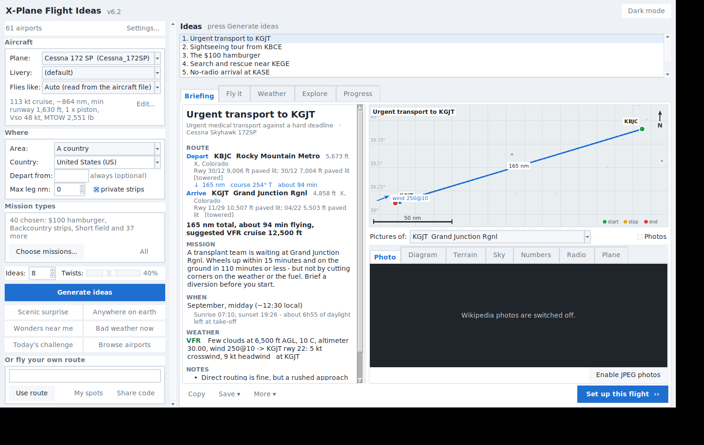
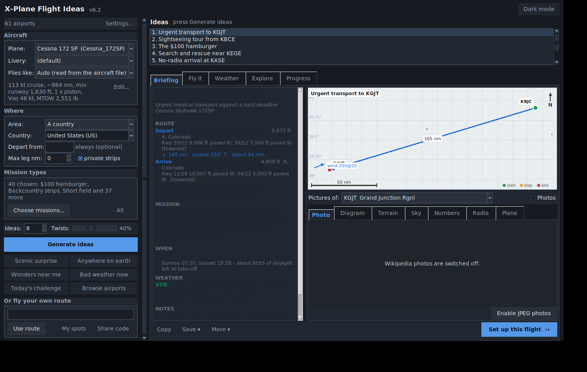
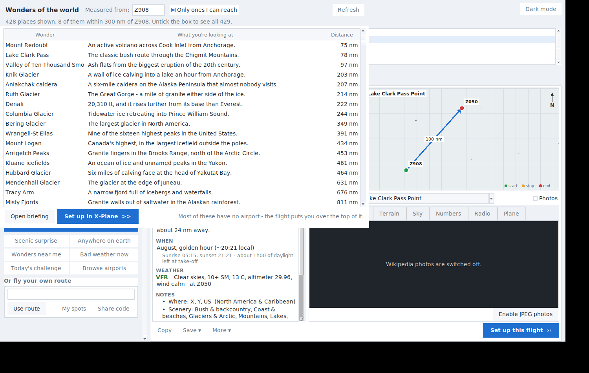

# X-Plane Flight Ideas

A desktop app that answers the question every simmer asks when the sim finishes loading: **where should I fly today?**

It reads your own X-Plane scenery and aircraft, invents a flight worth making — with a mission, weather, a time of day and a twist — and then sets the whole thing up in X-Plane for you: aircraft, livery, position, date, time, weather, payload, and the route in the GPS.

Python + Tkinter, no build step, no account, works offline.




---

## What it does

**Generates flights worth making.** 43 mission types, from the $100 hamburger to a low-visibility approach down to minimums, a mountain-pass crossing, a survey grid, a poker run or a search pattern. Pick the kinds you feel like, press Generate, get a briefing.

**Flies you somewhere beautiful.** 456 hand-picked scenic routes worldwide across ten categories (mountains, islands, coast, glaciers, canyons, volcanoes, water, landmarks, jungle, bush), plus "hidden gems" found in your own scenery from terrain, runway and name clues.

**Takes you to 429 natural wonders — most of which have no airport.** Angel Falls, Everest, the Matterhorn, Iguazu, Uluru, Halong Bay, Sossusvlei, the Richat Structure, the Grand Prismatic Spring, Erta Ale's lava lake. The app finds the nearest runway your aeroplane can actually use, routes you over the thing itself as a GPS waypoint, and tells you how high the ground goes — or says plainly that the summit is above your ceiling and you should fly alongside instead.

**Or throws a dart at the planet.** "Anywhere on earth" picks a genuinely random destination out of your own scenery, leaning towards ground worth looking at: big relief nearby, high fields, gravel strips, water runways, high latitudes. It tells you what the dice picked and why it might be worth the trip.

**Uses the scenery you actually installed.** It reads `Custom Scenery` and `scenery_packs.ini` and knows which airports come from add-on packs and which map tiles have ortho or custom mesh. Then it can *favour* those places — or use *only* them. It will also tell you which add-on airports you have never once flown into.

**Sets up the flight in X-Plane.** Through X-Plane 12.4's Web API: aircraft and livery, start on a runway / at a gate / on final / in the air, date and time, weather (mission, real-world, preset, or leave it alone), payload and fuel. The route goes into the GPS through a small companion plugin.

**Does the numbers.** Density altitude, the best runway for the wind with head and crosswind components, takeoff and landing distances against the runway you actually have, fuel with reserves against tank capacity, and weight against MTOW. Calibrated against a Cessna 172's published figures — within a few percent from sea level to 8,000 ft — but explicitly rules of thumb, not a flight manual.

**Finds real weather to fly into.** Every current METAR worldwide from aviationweather.gov, ranked by how nasty it is: thunderstorms, snow and freezing rain, strong or gusty wind, fog, low ceilings, low visibility, dust and smoke. Pick a row and it builds a flight into it — or out of it.

**Scores the flight.** It watches the landing and grades touchdown rate, distance past the threshold, centreline offset and smoothness, then writes it into a logbook with hours, miles, airports and badges, and a rating from Student to Legend.

**And the rest.** Trips flown leg by leg, a tour builder, routes shared by other pilots from flightplandatabase.com, real traffic from the OpenSky Network, ATIS and radio calls written out, your own lat/lon landing spots, a kneeboard, terrain profiles, nav logs, GPX/KML/Little Navmap exports, a printable briefing sheet, the briefing served to your phone with a QR code, backups, and a light/dark theme.

<p align="center">
  
  
</p>

---

## Getting started

1. **Install Python 3.8 or newer** from [python.org](https://www.python.org/downloads/) — tick *Add Python to PATH* during install. Nothing else is required.
2. **Download or clone this repository** and keep the files together in one folder.
3. **Run it**
   - Windows: double-click `Flight Ideas.bat`
   - macOS / Linux: `python3 xp_flight_ideas_gui.py`
4. The app finds X-Plane on its own; if it doesn't, point it at the folder with *Browse…*. The first scenery scan takes up to a minute and is cached afterwards.

Optional extras:

- **Pillow** (`pip install pillow`) for JPEG airport photos — there's a button in the app that installs it for you.
- **[XPPython3](https://xppython3.readthedocs.io)** plus the bundled `PI_FlightIdeas.py` if you want routes loaded into the GPS automatically. The app has an *Install GPS plugin…* button.
- X-Plane 12.4 or newer with the Web API enabled (*Settings → Network*) to launch flights from the app. Everything else works without it.

## Command line

The engine runs without the GUI:

```bash
python xp_flight_ideas.py --help
python xp_flight_ideas.py --from KBJC -n 5           # five ideas out of one airport
python xp_flight_ideas.py --world --mission scenic   # anywhere in the world
python xp_flight_ideas.py --country NZ --save        # and write .fms plans
python xp_flight_ideas.py --live-weather ts          # fly into a real thunderstorm
python xp_flight_ideas.py --anywhere -n 5            # somewhere random on earth
python xp_flight_ideas.py --wonders-near KBJC        # what's worth seeing near you
```

## What's in the box

| File | What it is |
| --- | --- |
| `xp_flight_ideas_gui.py` | the app |
| `xp_flight_ideas.py` | idea engine and command-line version |
| `xp_link.py` | talks to X-Plane's Web API |
| `xp_scenery.py` | which add-on scenery you have installed |
| `xp_perf.py` | density altitude, runway lengths, fuel, weight |
| `xp_wx.py` | live weather from aviationweather.gov |
| `xp_scenic.py` | the worldwide scenic database and the random generator |
| `xp_wonders.py` | 429 natural wonders and landmarks, with positions and heights |
| `xp_radio.py` | ATIS, radio calls, your own landing spots |
| `xp_images.py` | maps, airport diagrams, sky pictures, photos |
| `xp_score.py` | landing scoring and the logbook |
| `xp_export.py` | nav logs, briefing sheets, GPX/KML/LNM, share codes |
| `xp_career.py` | ratings, badges, challenge of the day |
| `xp_terrain.py` | terrain along the route |
| `xp_acf.py` | reads performance out of your `.acf` files |
| `xp_theme.py` | the look of the app, light and dark |
| `xp_online.py` | OurAirports, flightplandatabase.com, OpenSky |
| `xp_web.py` / `xp_qr.py` | the briefing on your phone, and backups |
| `PI_FlightIdeas.py` | the XPPython3 plugin that loads routes into the GPS |
| `README.txt` | the full manual, every feature explained |

`README.txt` is the real manual — this page is the tour.

## Where the data comes from

All optional; the app works with no internet at all, using only your own scenery.

| Source | What for |
| --- | --- |
| [aviationweather.gov](https://aviationweather.gov) | current METARs and TAFs |
| [OurAirports](https://ourairports.com) | city, region, country, airport type, Wikipedia links |
| [flightplandatabase.com](https://flightplandatabase.com) | routes shared by other pilots |
| [OpenSky Network](https://opensky-network.org) | which aircraft are airborne right now |
| [opentopodata.org](https://www.opentopodata.org) | terrain elevations |
| Wikipedia | airport photos and articles |

## Notes

- Performance figures are estimates calibrated against one light aircraft's published data. They are a sanity check, not certified performance data — fly with your own margins.
- The phone-briefing server runs only while its window is open, and while it does, anything on your network can open that page.
- Nothing is uploaded anywhere. Settings, logbook and trips live in `.xp_flight_ideas` in your home folder, and there's a backup/restore button.

## Licence

MIT — see [LICENSE](LICENSE).
