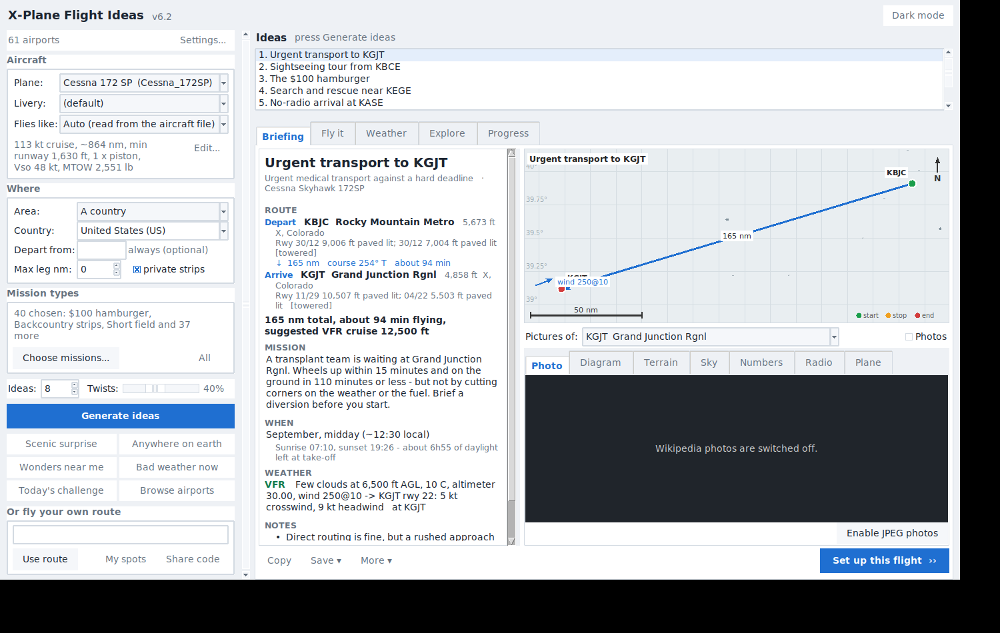
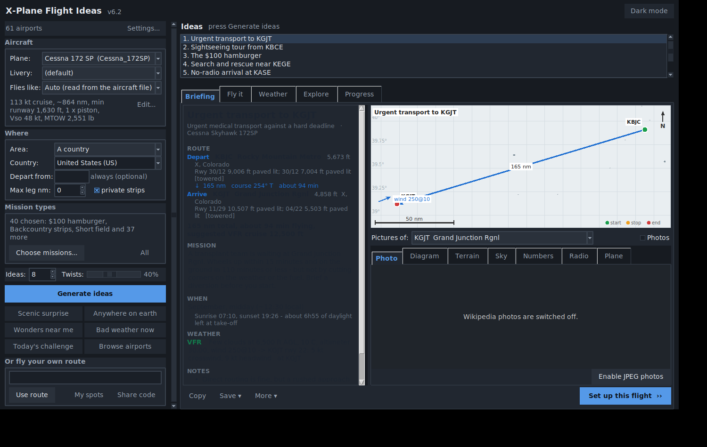
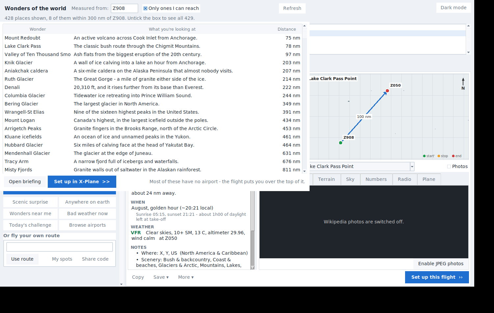
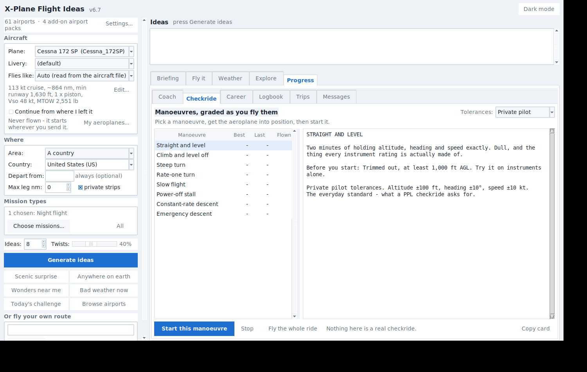
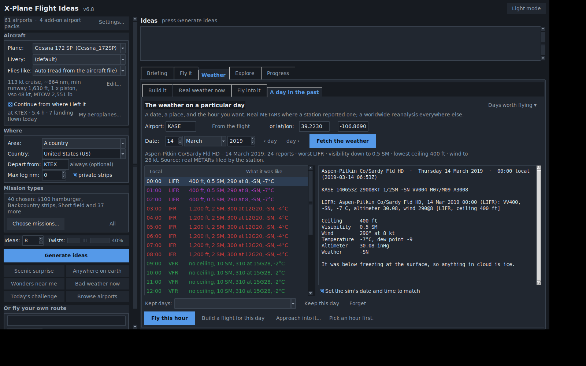

# X-Plane Flight Ideas

A desktop app that answers the question every simmer asks when the sim finishes loading: **where should I fly today?**

It reads your own X-Plane scenery and aircraft, invents a flight worth making — with a mission, weather, a time of day and a twist — and then sets the whole thing up in X-Plane for you: aircraft, livery, position, date, time, weather, payload, and the route in the GPS.

Python + Tkinter, no build step, no account, works offline.




---

## What it does

**Generates flights worth making.** 43 mission types, from the $100 hamburger to a low-visibility approach down to minimums, a mountain-pass crossing, a survey grid, a poker run or a search pattern. Pick the kinds you feel like, press Generate, get a briefing.

**Flies you somewhere beautiful.** 456 hand-picked scenic routes worldwide across ten categories (mountains, islands, coast, glaciers, canyons, volcanoes, water, landmarks, jungle, bush), plus "hidden gems" found in your own scenery from terrain, runway and name clues.

**Takes you to 429 natural wonders — most of which have no airport.** Angel Falls, Everest, the Matterhorn, Iguazu, Uluru, Halong Bay, Sossusvlei, the Richat Structure, the Grand Prismatic Spring, Erta Ale's lava lake. The app finds the nearest runway your aeroplane can actually use, routes you over the thing itself as a GPS waypoint, and tells you how high the ground goes — or says plainly that the summit is above your ceiling and you should fly alongside instead.

**Or throws a dart at the planet.** "Anywhere on earth" picks a genuinely random destination out of your own scenery, leaning towards ground worth looking at: big relief nearby, high fields, gravel strips, water runways, high latitudes. It tells you what the dice picked and why it might be worth the trip.

**Doesn't actually need X-Plane.** The app is built to read your own scenery — that's the point of it — but on a machine without the simulator it offers to download the OurAirports database instead: around eighty thousand airports worldwide with their runways, surfaces, lighting, thresholds and frequencies, reshaped into exactly the records the apt.dat parser produces. The generator, the scenic engine, the wonders, the approach geometry, the briefings and the exports all work without knowing the difference. What's genuinely missing is ILS (no open equivalent to `earth_nav.dat`, so approaches become RNAV straight-ins), your own aircraft (built-in profiles stand in), and setting the flight up in the sim. Plan on the laptop, save the `.fms`, fly it later on the machine that has X-Plane.

**Puts scenery_packs.ini back in order.** X-Plane draws scenery top-down — the first pack that covers a tile wins — and it writes that file alphabetically, which is almost never right. So your custom airport ends up under a mesh, or your ortho hides behind default terrain. The app reads the file, works out what each pack actually is by looking inside the folder, tells you what's wrong in plain words, shows you the order it would write, and only then rewrites it — keeping a dated copy of the old one. Airports over overlays over photo ground over mesh, which is what lets simHeaven X-World and X-Plane Map Enhancement coexist instead of fighting. Packages that number their own folders, like X-World, keep their own order and stay together.

**Uses the scenery you actually installed.** It reads `Custom Scenery` and `scenery_packs.ini` and knows which airports come from add-on packs and which map tiles have ortho or custom mesh. Then it can *favour* those places — or use *only* them. It will also tell you which add-on airports you have never once flown into.

**Sets up the flight in X-Plane.** Through X-Plane 12.4's Web API: aircraft and livery, start on a runway / at a gate / on final / in the air, date and time, weather (mission, real-world, preset, or leave it alone), payload and fuel. The route goes into the GPS through a small companion plugin.

**Sets the aeroplane up, not just its position.** Tick one box and the approach tunes NAV1 and NAV2 to the localizer with the course in magnetic degrees, puts tower or CTAF on COM1 and ATIS on COM2, sets the altimeter, winds the altitude bug to the missed approach height, and arms the autopilot — or couples it and lets it fly, or leaves it alone entirely. Airports with no localizer get an RNAV straight-in built into the GPS. It says plainly what it can't do: aircraft with their own avionics ignore X-Plane's datarefs, and the straight-in is not the charted procedure.

**Drops you straight onto final, over and over.** Type an airport, and it picks the runway (the instrument one, or the one with the headwind), reads the localizer frequency out of your scenery, and tells you what you're about to be dropped into: the height you'll appear at, the descent rate and speed to hold, the wind on the runway, the usual minimums, and whether you'll actually see the runway in that weather. Press it again after every go-around.

**Does the numbers.** Density altitude, the best runway for the wind with head and crosswind components, takeoff and landing distances against the runway you actually have, fuel with reserves against tank capacity, and weight against MTOW. Calibrated against a Cessna 172's published figures — within a few percent from sea level to 8,000 ft — but explicitly rules of thumb, not a flight manual.

**Builds weather worth flying in.** A workshop for the conditions themselves: three cloud layers by hand, turbulence and wind shear per wind layer — all of which X-Plane accepts and most tools never send — and a read-out of what it means. Where the freezing level sits, whether you'd pick up ice and what kind, how rough each level is, the crosswind on the best runway, and whether your aeroplane is up to it. Thirteen one-click hazards from fog to freezing rain, and a generator that builds a whole flight around any of them.

**Flies a day that has already happened.** Pick a place, a date and an hour — 14 March 2019 at Aspen, the Blizzard of '78 at Boston, a Tuesday in 1961 over the Sahara — and it fetches the weather that was really there. Where a station filed METARs, those are the METARs, hour by hour, colour-coded VFR to LIFR so you can watch the front come through and pick your moment. Everywhere else, and for dates before the station existed, it falls back to ERA5 reanalysis, which covers the whole planet back to 1940 and is labelled as the model it is. It sets the sim's date and time to match, so the sun and the season go with the weather. Days you liked can be kept by name, and everything fetched is cached, so it flies again offline.

**Finds real weather to fly into.** Every current METAR worldwide from aviationweather.gov, ranked by how nasty it is: thunderstorms, snow and freezing rain, strong or gusty wind, fog, low ceilings, low visibility, dust and smoke — on one severity scale that means the same thing whichever hazard you filter for. Pick a row and it builds a flight into it, or out of it; when nothing meets your threshold it tells you what the worst on offer is and where.

**Scores the flight.** It watches the landing and grades touchdown rate, distance past the threshold, centreline offset and smoothness, then writes it into a logbook with hours, miles, airports and badges, and a rating from Student to Legend.

**Then reads that logbook back to you.** Not totals — patterns. The conditions you're measurably worse in, which part of your landing is letting the other two down, whether you were better a month ago, the airport you keep going back to, the kinds of flying you've quietly stopped doing. Each one stated with the numbers behind it so you can argue with it, and each with a button that builds the flight that fixes it. Alongside it, rolling currency counted the way the FAA counts it — a scoreboard, not a licence.

**Grades your manoeuvres while you fly them.** Eight of them: straight and level, a climb to a level-off, a steep turn, a rate-one 180, slow flight, a power-off stall, a constant-rate descent and an emergency descent. Get into position, press start, and it watches the sim four times a second, works out when you've finished, and hands you a card — worst deviation in each thing it was measuring, against the tolerance, with a mark. Private-pilot tolerances or commercial. Fly one, or queue the whole ride.

**Breaks something on the way down.** The approach can fail a system as you descend — one you pick, or a surprise that tells you only that *something* has broken and leaves you to find it.

**Keeps your aeroplanes where you left them.** Fly Denver to Aspen and the aeroplane is in Aspen next time, with the hours and landings on that airframe. Switch it on and the next flight has to start from there.

**And the rest.** Trips flown leg by leg, a tour builder, routes shared by other pilots from flightplandatabase.com, real traffic from the OpenSky Network, ATIS and radio calls written out, your own lat/lon landing spots, a kneeboard, terrain profiles, nav logs, GPX/KML/Little Navmap exports, a printable briefing sheet, the briefing served to your phone with a QR code, backups, and a light/dark theme.

<p align="center">
  
  
</p>





---

## Getting started

1. **Install Python 3.8 or newer** from [python.org](https://www.python.org/downloads/) — tick *Add Python to PATH* during install. Nothing else is required.
2. **Download or clone this repository** and keep the files together in one folder.
3. **Run it**
   - Windows: double-click `Flight Ideas.bat`
   - macOS / Linux: `python3 xp_flight_ideas_gui.py`
4. The app finds X-Plane on its own; if it doesn't, point it at the folder with *Browse…*. The first scenery scan takes up to a minute and is cached afterwards.

Optional extras:

- **Pillow** (`pip install pillow`) for JPEG airport photos — there's a button in the app that installs it for you.
- **[XPPython3](https://xppython3.readthedocs.io)** plus the bundled `PI_FlightIdeas.py` if you want routes loaded into the GPS automatically. The app has an *Install GPS plugin…* button.
- X-Plane 12.4 or newer with the Web API enabled (*Settings → Network*) to launch flights from the app. Everything else works without it.

## Command line

The engine runs without the GUI:

```bash
python xp_flight_ideas.py --help
python xp_flight_ideas.py --from KBJC -n 5           # five ideas out of one airport
python xp_flight_ideas.py --world --mission scenic   # anywhere in the world
python xp_flight_ideas.py --country NZ --save        # and write .fms plans
python xp_flight_ideas.py --live-weather ts          # fly into a real thunderstorm
python xp_flight_ideas.py --anywhere -n 5            # somewhere random on earth
python xp_flight_ideas.py --wonders-near KBJC        # what's worth seeing near you
```

## What's in the box

| File | What it is |
| --- | --- |
| `xp_flight_ideas_gui.py` | the app |
| `xp_flight_ideas.py` | idea engine and command-line version |
| `xp_link.py` | talks to X-Plane's Web API |
| `xp_scenery.py` | which add-on scenery you have installed |
| `xp_perf.py` | density altitude, runway lengths, fuel, weight |
| `xp_approach.py` | approach geometry, runway choice, minimums |
| `xp_hazard.py` | icing, turbulence, shear and the inclement-weather scenarios |
| `xp_avionics.py` | tunes the radios, sets the bugs, arms the autopilot |
| `xp_wx.py` | live weather from aviationweather.gov |
| `xp_scenic.py` | the worldwide scenic database and the random generator |
| `xp_wonders.py` | 429 natural wonders and landmarks, with positions and heights |
| `xp_radio.py` | ATIS, radio calls, your own landing spots |
| `xp_images.py` | maps, airport diagrams, sky pictures, photos |
| `xp_score.py` | landing scoring and the logbook |
| `xp_history.py` | the weather on a past date, from two archives |
| `xp_world.py` | every airport on earth, for machines with no X-Plane |
| `xp_packs.py` | puts `scenery_packs.ini` back in the right order |
| `xp_coach.py` | reads the logbook back to you, and rolling currency |
| `xp_checkride.py` | manoeuvres graded live against real tolerances |
| `xp_fleet.py` | where each of your aeroplanes was left |
| `xp_export.py` | nav logs, briefing sheets, GPX/KML/LNM, share codes |
| `xp_career.py` | ratings, badges, challenge of the day |
| `xp_terrain.py` | terrain along the route |
| `xp_acf.py` | reads performance out of your `.acf` files |
| `xp_theme.py` | the look of the app, light and dark |
| `xp_online.py` | OurAirports, flightplandatabase.com, OpenSky |
| `xp_web.py` / `xp_qr.py` | the briefing on your phone, and backups |
| `PI_FlightIdeas.py` | the XPPython3 plugin that loads routes into the GPS |
| `README.txt` | the full manual, every feature explained |

`README.txt` is the real manual — this page is the tour.

## Where the data comes from

All optional; the app works with no internet at all, using only your own scenery.

| Source | What for |
| --- | --- |
| [aviationweather.gov](https://aviationweather.gov) | current METARs and TAFs |
| [OurAirports](https://ourairports.com) | city, region, country, airport type, Wikipedia links — and the whole airport list when there's no X-Plane |
| [flightplandatabase.com](https://flightplandatabase.com) | routes shared by other pilots |
| [OpenSky Network](https://opensky-network.org) | which aircraft are airborne right now |
| [opentopodata.org](https://www.opentopodata.org) | terrain elevations |
| [Iowa State ASOS archive](https://mesonet.agron.iastate.edu/request/download.phtml) | archived METARs, for flying a past date |
| [Open-Meteo](https://open-meteo.com) | ERA5 reanalysis, for past dates anywhere on earth |
| Wikipedia | airport photos and articles |

## Notes

- Historical weather from reanalysis is modelled, not observed, and ERA5 carries no visibility at all — the app derives it from the temperature/dew-point spread and the precipitation, and says so on every hour it does that for.
- The checkride grader and the currency counters are modelled on the FAA's numbers because those are the ones most people know. Nothing done in a simulator counts towards anything real.
- Performance figures are estimates calibrated against one light aircraft's published data. They are a sanity check, not certified performance data — fly with your own margins.
- The phone-briefing server runs only while its window is open, and while it does, anything on your network can open that page.
- Nothing is uploaded anywhere. Settings, logbook and trips live in `.xp_flight_ideas` in your home folder, and there's a backup/restore button.

## Licence

MIT — see [LICENSE](LICENSE).
